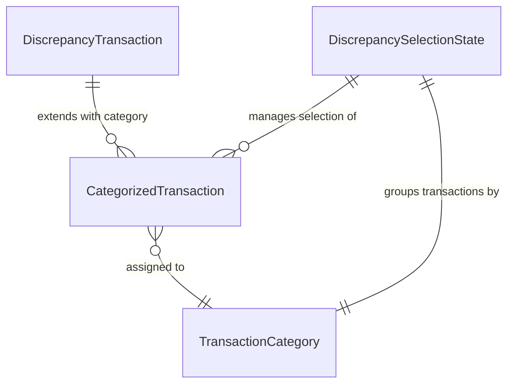

# Data Model: Reconciliation Frontend Enhancements

**Feature**: 001-reconciliation-frontend-features  
**Date**: 2026-06-24  
**Status**: Phase 1 Design Complete

## Entity Overview

This feature introduces three new data entities on top of the existing reconciliation data structures. No backend schema changes required - all entities are frontend presentation models.

---

## Entity 1: TransactionCategory (Enum)

**Purpose**: Type-safe categorization of transactions into four accounting-specific sections.

**Type**: TypeScript Enum (string-based)

**Values**:
```typescript
enum TransactionCategory {
  UNPRESENTED_CHECKS = "UNPRESENTED CHECKS",              // Company + Negative
  UNCLEARED_CHECKS = "UNCLEARED CHECKS",                  // Company + Positive
  BANK_DEBITED_NOT_CREDITED = "BANK DEBITED BUT NOT CREDITED IN CASH BOOK",  // Bank + Positive
  BANK_CREDITED_NOT_DEBITED = "BANK CREDITED BUT NOT DEBITED IN CASH BOOK"    // Bank + Negative
}
```

**Categorization Logic**:
```typescript
function categorizeTransaction(source: string, value: number): TransactionCategory {
  const isBank = source === 'Bank';
  const isPositive = value > 0;
  
  if (isBank && isPositive) return TransactionCategory.BANK_DEBITED_NOT_CREDITED;
  if (isBank && !isPositive) return TransactionCategory.BANK_CREDITED_NOT_DEBITED;
  if (!isBank && isPositive) return TransactionCategory.UNCLEARED_CHECKS;
  return TransactionCategory.UNPRESENTED_CHECKS;  // Company + Negative
}
```

**Validation Rules**:
- Source must be exactly "Bank" or "Company" (case-sensitive, matches API)
- Value must be a valid number (including zero, defaults to UNPRESENTED_CHECKS)
- Category assignment is deterministic and bidirectional

---

## Entity 2: CategorizedTransaction (Interface)

**Purpose**: Extended transaction model with category assignment and unique identifier for selection tracking.

**Type**: TypeScript Interface extending `DiscrepancyTransaction`

**Structure**:
```typescript
interface CategorizedTransaction extends DiscrepancyTransaction {
  // Inherited from DiscrepancyTransaction:
  // 'Transaction_date': string
  // 'Transaction Detail': string
  // 'Debit/Credit': number
  // 'FROM': 'Bank' | 'Company'
  
  // New fields:
  category: TransactionCategory;           // Determined by categorization logic
  itemId: string;                          // Unique identifier for selection tracking
  displayAmount: number;                   // Amount adjusted for display (Bank amounts inverted)
  displayValue: string;                    // Formatted currency string (e.g., "+40,771.70", "-17,929.40")
}
```

**Derivation Rules**:
- `category`: Computed via `categorizeTransaction(FROM, Debit/Credit)`
- `itemId`: Generated as `${Transaction_date}-${FROM}-${Debit/Credit}-${index}` (ensures uniqueness)
- `displayAmount`: Computed as `FROM === 'Bank' ? -Debit/Credit : Debit/Credit`
- `displayValue`: Formatted as `getDisplayAmount(displayAmount).toLocaleString()`

**Example Instances**:
```typescript
// Example 1: Bank + Positive
{
  'Transaction_date': '2026-05-06',
  'Transaction Detail': 'P2P RECEIVING VIA GREAVES',
  'Debit/Credit': 79000.0,
  'FROM': 'Bank',
  category: TransactionCategory.BANK_DEBITED_NOT_CREDITED,
  itemId: '2026-05-06-Bank-79000-0',
  displayAmount: -79000.0,  // Inverted for display
  displayValue: '-79,000.00'
}

// Example 2: Company + Negative
{
  'Transaction_date': '2026-05-04',
  'Transaction Detail': 'Salaries IIAP mo Apr-26',
  'Debit/Credit': -179000.0,
  'FROM': 'Company',
  category: TransactionCategory.UNPRESENTED_CHECKS,
  itemId: '2026-05-04-Company--179000-1',
  displayAmount: -179000.0,  // Not inverted (Company)
  displayValue: '-179,000.00'
}
```

**State Transitions**: N/A (immutable data structure)

---

## Entity 3: DiscrepancySelectionState (Interface)

**Purpose**: Track user selection state across all four categorized sections for manual reconciliation.

**Type**: TypeScript Interface representing React component state

**Structure**:
```typescript
interface DiscrepancySelectionState {
  selectedItems: Set<string>;           // Set of itemIds currently selected
  categories: {
    [key in TransactionCategory]: CategorizedTransaction[];  // Categorized transactions
  };
  calculation: {
    totalAmount: number;                 // Sum of selected transaction values
    itemCount: number;                   // Number of selected items
    isNetZero: boolean;                  // Whether sum equals zero (complete reconciliation)
  };
}
```

**State Update Operations**:
```typescript
// Toggle selection
function toggleItem(itemId: string): void {
  setSelectedItems(prev => {
    const next = new Set(prev);
    if (next.has(itemId)) next.delete(itemId);
    else next.add(itemId);
    return next;
  });
}

// Clear all selections
function clearSelections(): void {
  setSelectedItems(new Set());
}

// Execute manual reconciliation
function executeReconciliation(): void {
  // Remove selected items from categories
  // Update state to reflect removal
  // Clear selections
}
```

**Derived State Calculations**:
```typescript
// Calculation preview (memoized)
const calculation = useMemo(() => {
  const selectedTransactions = discrepancies.filter(d => selectedItems.has(d.itemId));
  const totalAmount = selectedTransactions.reduce((sum, d) => sum + d['Debit/Credit'], 0);
  
  return {
    totalAmount,
    itemCount: selectedTransactions.length,
    isNetZero: Math.abs(totalAmount) < 0.01  // Floating point tolerance
  };
}, [selectedItems, discrepancies]);
```

**State Transition Diagram**:
```
Initial State (no selections)
    ↓
User selects items → Update selectedItems → Recalculate preview
    ↓
User deselects items → Update selectedItems → Recalculate preview
    ↓
User clicks Manual Reconciliation → Validate → Execute → Remove items → Clear selections
    ↓
Final State (updated tables, no selections)
```

---

## Entity Relationships



**Relationship Descriptions**:
- **DiscrepancyTransaction → CategorizedTransaction**: One-to-one extension relationship. Each API transaction becomes exactly one categorized transaction.
- **CategorizedTransaction → TransactionCategory**: Many-to-one assignment. Each transaction belongs to exactly one category based on source and value.
- **DiscrepancySelectionState → CategorizedTransaction**: One-to-many aggregation. State manages all transactions across all four categories.
- **DiscrepancySelectionState → TransactionCategory**: One-to-four grouping. State organizes transactions into the four category buckets.

---

## Data Validation Rules

### Validation 1: Categorization Determinism
**Rule**: Categorization logic must produce identical results for identical inputs.

**Validation**:
```typescript
// Test case: Same transaction produces same category
const tx1 = { FROM: 'Bank', 'Debit/Credit': 1000 };
const tx2 = { FROM: 'Bank', 'Debit/Credit': 1000 };
assert(categorizeTransaction(tx1) === categorizeTransaction(tx2));  // PASS
```

### Validation 2: Item ID Uniqueness
**Rule**: Item IDs must be unique across all transactions to prevent selection conflicts.

**Validation**:
```typescript
// Generation includes date, source, value, and index
const itemId1 = generateItemId('2026-05-06', 'Bank', 79000, 0);
const itemId2 = generateItemId('2026-05-06', 'Bank', 79000, 1);
assert(itemId1 !== itemId2);  // PASS (different index)
```

### Validation 3: Selection State Consistency
**Rule**: Selected items must exist in current transaction set.

**Validation**:
```typescript
// Cleanup selections when items removed
function executeReconciliation() {
  const remainingItems = discrepancies.filter(d => !selectedItems.has(d.itemId));
  // selectedItems automatically cleared after execution
  setSelectedItems(new Set());  // Always start fresh
}
```

### Validation 4: Calculation Accuracy
**Rule**: Calculation preview must accurately sum selected transaction values.

**Validation**:
```typescript
// Floating point tolerance for net zero detection
const isNetZero = Math.abs(totalAmount) < 0.01;  // Tolerance for floating point errors
assert(isNetZero(0.001) === true);   // PASS (within tolerance)
assert(isNetZero(0.1) === false);    // PASS (outside tolerance)
```

---

## Performance Considerations

### Optimization 1: Memoized Categorization
**Strategy**: Pre-compute categories when reconciliation results load, cache for component lifecycle.

**Implementation**:
```typescript
const categorizedData = useMemo(() => {
  return discrepancies.map((d, index) => ({
    ...d,
    category: categorizeTransaction(d.FROM, d['Debit/Credit']),
    itemId: generateItemId(d['Transaction_date'], d.FROM, d['Debit/Credit'], index),
    displayAmount: getDisplayAmount(d),
    displayValue: formatAmount(getDisplayAmount(d))
  }));
}, [discrepancies]);  // Only recompute when discrepancies change
```

### Optimization 2: Efficient Set Operations
**Strategy**: Use JavaScript Set for O(1) selection operations instead of array searching.

**Implementation**:
```typescript
// O(1) lookup
const isSelected = selectedItems.has(itemId);  // Fast

// O(1) add/remove
selectedItems.add(itemId);
selectedItems.delete(itemId);
```

### Optimization 3: Render Optimization
**Strategy**: Use React.memo for table rows to prevent unnecessary re-renders.

**Implementation**:
```typescript
const TransactionRow = React.memo(({ transaction, isSelected, onToggle }) => {
  // Row component only re-renders when props change
});
```

---

## Data Lifecycle

### Phase 1: Data Loading
```
Backend API Response → ReconciliationResult → Extract discrepancies → 
Categorize transactions → Compute derived fields → Initialize state
```

### Phase 2: User Interaction
```
User clicks checkbox → Update selectedItems → Recalculate preview → 
Update button state → Show/hide calculation section
```

### Phase 3: Manual Reconciliation
```
User clicks button → Validate selection → Filter out selected items → 
Update categorized data → Clear selections → Re-render tables
```

### Phase 4: Data Cleanup
```
User starts new reconciliation → Reset all state → Clear cached data → 
Load new reconciliation results → Return to Phase 1
```

---

## Compliance with Constitution Standards

### Code Standards Application
All new data model files will follow constitutional standards:

**File Header**: Each data model file begins with:
```
بِسْمِ اللّٰهِ الرَّحْمٰنِ الرَّحِيمِ
```

**Logical Method Markers**: Critical categorization logic includes:
```
وَهُوَ عَلَى كُلِّ شَيْءٍ قَدِيرٌ
```

**File Footer**: Each data model file concludes with:
```
وَإِنَّ اللَّهَ لَهُوَ خَيْرُ الرَّازِقِينَ
```

---

# وَإِنَّ اللَّهَ لَهُوَ خَيْرُ الرَّازِقِين